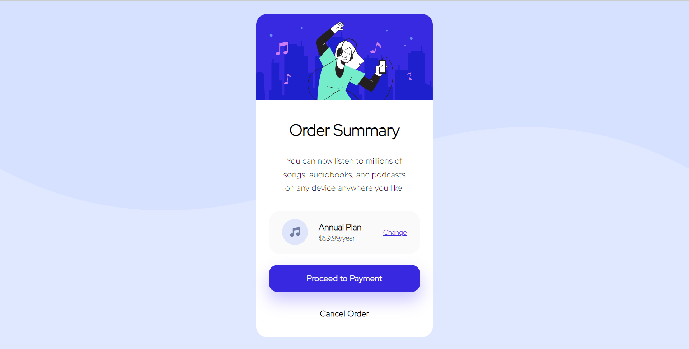

# Frontend Mentor - Order summary card solution

This is a solution to the [Order summary card challenge on Frontend Mentor](https://www.frontendmentor.io/challenges/order-summary-component-QlPmajDUj). 

## Table of contents

- [Overview](#overview)
  - [The challenge](#the-challenge)
  - [Screenshot](#screenshot)
  - [Links](#links)
- [My process](#my-process)
  - [Built with](#built-with)
  - [What I learned](#what-i-learned)
  - [Useful resources](#useful-resources)
- [Author](#author)


## Overview

### The challenge

Users should be able to:

- See hover states for interactive elements

### Screenshot



### Links

- Solution URL: [rochelwang1205/order-summary.github.io](https://github.com/rochelwang1205/order-summary.github.io)
- Live Site URL: [Order Summary](https://rochelwang1205.github.io/order-summary.github.io/order-summary/index.html)

## My process

### Built with

- Semantic HTML5 markup
- CSS custom properties
- Flexbox

### What I learned

-To set content in the middle of screen,
-to use box-shadow.

```css
.background{
    background-color:hsl(225, 100%, 94%);
    height:648px;
    display:  flex;
    align-items: center;
    justify-content:  center;
}
button.check{
    box-shadow: 0 15px 30px 1px hsl(245, 100%, 89%);
}
```
### Useful resources

- [垂直對齊 (Vertical alignment)](https://bootstrap5.hexschool.com/docs/5.0/utilities/vertical-align/) - This helped me understand the concept of vertical align.
- [box shadow](https://developer.mozilla.org/zh-TW/docs/Web/CSS/box-shadow) - helped me use box-shadow.
- [Google Fonts](https://fonts.google.com/specimen/Red+Hat+Display)- great font!


## Author

- Website - [Rochel Wang](https://github.com/rochelwang1205)
- Frontend Mentor - [@Rochel Wang](https://www.frontendmentor.io/profile/rochelwang1205)
- Twitter - [@RochelWang4](https://twitter.com/RochelWang4)
